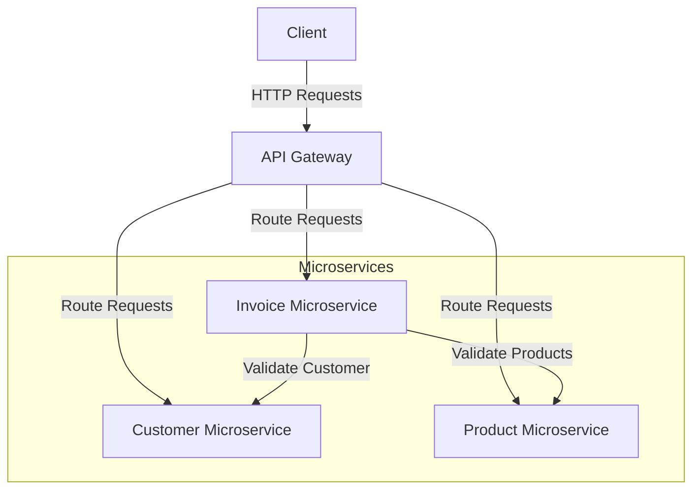

# ObservabilidadMicroservicios
POC de observabilidad en microservicios

---

Apreciados estudiantes,

La idea es hacer una presentación + PoC de máximo 20 min + 5 min de preguntas.

El entregable es la presentación y un link del repositorio del tema trabajado.

---

# Integrantes
- Santiago Medina Peláez
- Luis Eduardo Olaya Diáz
- Luis Horacio Londoño Cifuentes
- Daniel Hernan Arevalo Gutierrez
---
## 9. Observabilidad en Microservicios

- Subtemas clave para la presentación:
    - [x] ¿Qué es la observabilidad y por qué es clave en sistemas distribuidos?
    - [x] Diferencia entre monitoreo, logging y trazabilidad.
    - [x] Herramientas populares: Prometheus (métricas), Grafana (visualización), Jaeger (tracing).
    - [x] Cómo detectar y solucionar fallos en microservicios con observabilidad.
    - [x] Configuración de alertas y dashboards.

- Prueba de Concepto (PoC):
    - [x] Configurar un dashboard de Grafana para monitorear un sistema de microservicios.

# Diagrama

